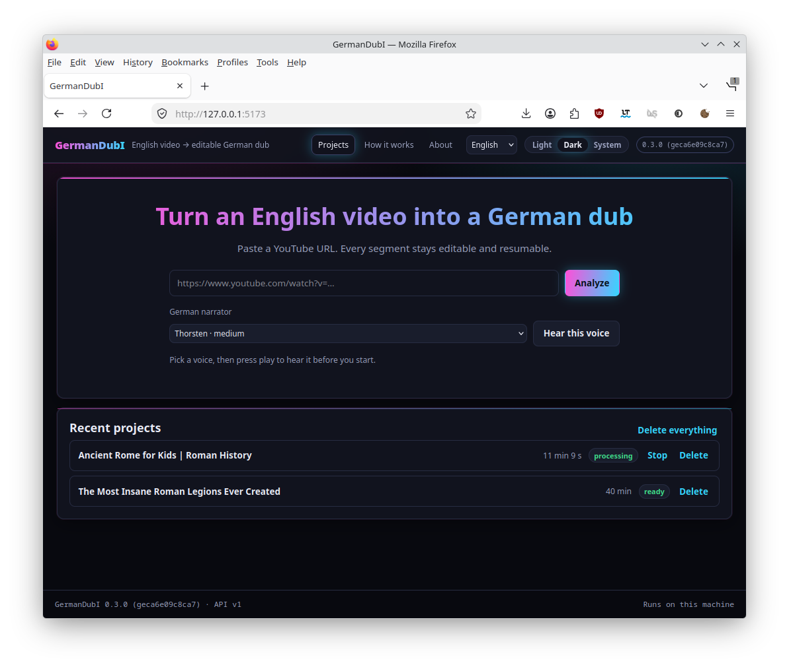

# GermanDubI

[](https://github.com/marcelpetrick/GermanDubI/actions/workflows/ci.yml)
[](https://github.com/marcelpetrick/GermanDubI/releases)
[](pyproject.toml)
[](pyproject.toml)
[](LICENSE)

**German Dub Interface** — English YouTube videos to German ones, made easy.

GermanDubI is a local-first, browser-based video dubbing workstation. Paste an English
video URL, press *Analyze*, press *Create German Dub*, and get an editable, synchronized
German dub while every intermediate stage stays inspectable and reproducible.

> The full product vision and technical architecture live in [`docs/product/vision.md`](docs/product/vision.md).
> Ways of working live in [`AGENTS.md`](AGENTS.md).
> Unresolved design decisions live in [`docs/project/questions.md`](docs/project/questions.md).
> The implemented system map lives in [`docs/architecture/c4.md`](docs/architecture/c4.md).

**Author: Marcel Petrick <mail@marcelpetrick.it>**

**License: GPLv3 or later. See `LICENSE`.**

**Note: project is generated with AI.**



---

## What it does

```text
YouTube URL
    ↓  probe → acquire → normalize
    ↓  captions or ASR → forced alignment → dubbing segments
    ↓  EN→DE translation → duration fitting → German TTS
    ↓  voice/background separation → mix → QA
    ↓
German-dubbed MKV/MP4 (+ DE/EN subtitles, original audio track kept)
```

The first target is deliberately narrow: **English source, German target, one dominant
narrator, Linux host, local browser UI.**

---

## Status

Early development (`0.x`). The project format and HTTP API are still evolving.
See [`CHANGELOG.md`](CHANGELOG.md) for what exists today.

---

## Requirements

Four things must already be on the machine. Everything else -- Python itself, `yt-dlp`, its
JavaScript challenge solver, the recognition, translation, speech and separation stacks --
is installed for you by `make setup`.

| Requirement | Notes |
| --- | --- |
| Linux | Primary and only supported host for `0.x` |
| [`uv`](https://docs.astral.sh/uv/) | Provisions the pinned Python and every Python dependency |
| Node.js 24 with `corepack` | Pinned in `.node-version`; `pnpm` comes from corepack. Also the JavaScript runtime `yt-dlp` needs to solve YouTube's challenge |
| `ffmpeg` / `ffprobe` | Media inspection, extraction, muxing. Your package manager has them |

`make preflight` checks all four and says what is missing; `make setup` runs it first, so a
missing one is named up front rather than surfacing later as something that looks like a bug
in this project.

Run `germandubi doctor` at any time to check the environment. It reports "Ready to dub"
only when a real translator and a real German voice are installed -- FFmpeg alone is not
enough to produce German, and a run without them is refused rather than filled in with
placeholder audio.

> **`make install` removes the provider stacks.** `uv sync --locked` installs exactly the
> locked default set, and the extras are not in it. Re-run `make install-providers`
> afterwards. `./localPipeline.sh` removes them too — the gate runs against deterministic
> fakes on purpose — but it restores what it found when it exits.

---

## Quick start

```bash
git clone https://github.com/marcelpetrick/GermanDubI.git
cd GermanDubI
make setup     # checks the four prerequisites, then installs everything and reports
make dev       # API + Vite dev server + processing worker
```

Then open the URL printed by the Vite dev server. `make setup` ends with a `doctor` report;
if it says "Ready to dub", paste a YouTube URL and press Analyze.

```bash
./localPipeline.sh            # the complete gate, exactly as CI runs it
```

## The interface

| | |
| --- | --- |
| Themes | Light, dark, or follow the system — chosen in the header and remembered |
| Languages | English, Deutsch, Hrvatski, 中文. This translates the **interface**; dubs are always English to German |
| Help | `/help` walks the workflow and lists all sixteen pipeline stages |
| About | `/about` names the tools, licences, author, repository, and the providers installed right now |
| Version | Shown in the header on every screen, linking to the build detail |

The segment table filters to flagged, needs-review or failed segments, which is how a
review pass on a 500-segment dub stays practical.

---

## Repository layout

```text
backend/    Python modular monolith (domain / application / infrastructure / api / worker / cli)
frontend/   React + TypeScript + Vite single-page app
e2e/        Playwright end-to-end tests
docs/       Product, project, architecture, ADR, development, operations and review docs
scripts/    Thin wrappers used by the Makefile
```

[`docs/README.md`](docs/README.md) is the index for the complete documentation set.

---

## Developer commands

| Command | Purpose |
| --- | --- |
| `make dev` | Run API, frontend and worker together |
| `make check` | Fast inner loop: lint, types, tests |
| `make pipeline` | Run the complete gate exactly as CI runs it |
| `make test` | Run the whole test suite |
| `make test-e2e` | Run the deterministic browser workflow in Chromium |
| `make lint` / `make format` | Ruff + ESLint/Prettier |
| `make typecheck` | `mypy --strict` and `tsc --noEmit` |
| `make openapi` | Regenerate browser types after an API contract change |
| `make build` | Build the wheel and production browser bundle |
| `make version` | Print the VCS-derived build version |

---

## Licensing and rights

GermanDubI is free software released under the
[GNU General Public License v3 or later](LICENSE). Contributions are welcome; see
[`CONTRIBUTING.md`](CONTRIBUTING.md).

The software does not circumvent access controls or DRM. **Users are responsible for
holding the rights to process and redistribute any source content**, and for holding
authorization for any voice they reproduce. See [`SECURITY.md`](SECURITY.md).
