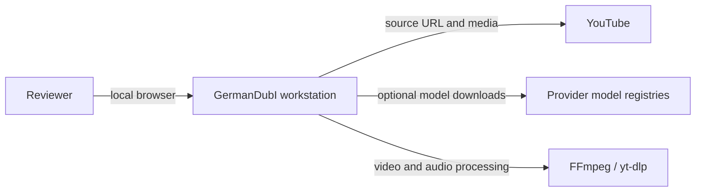
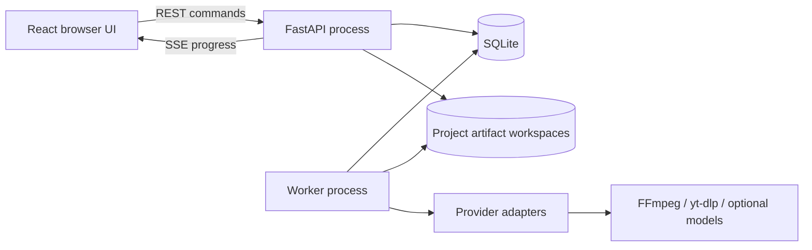
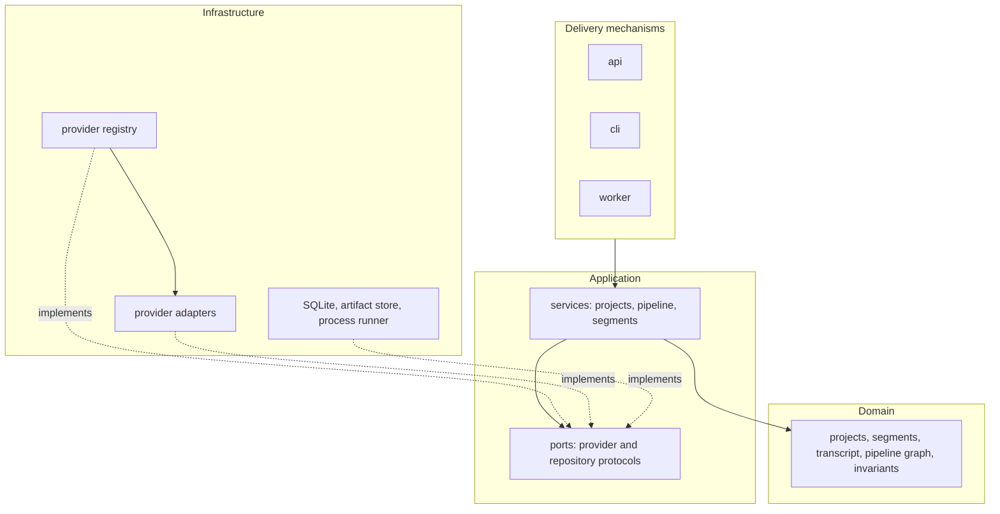
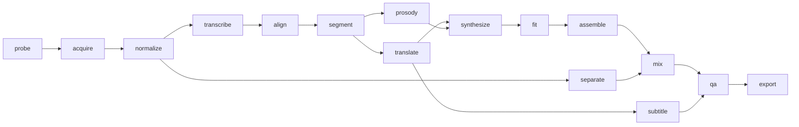
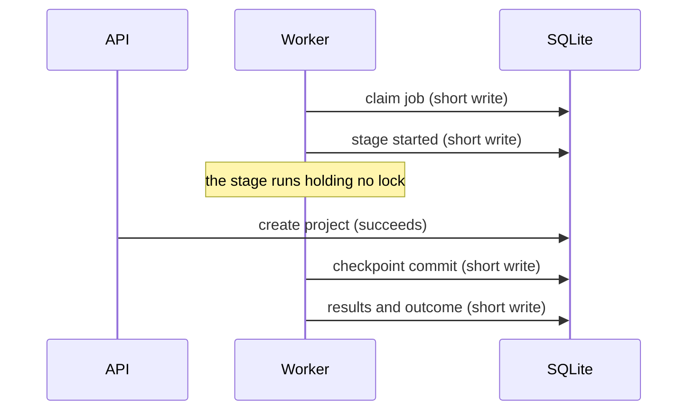
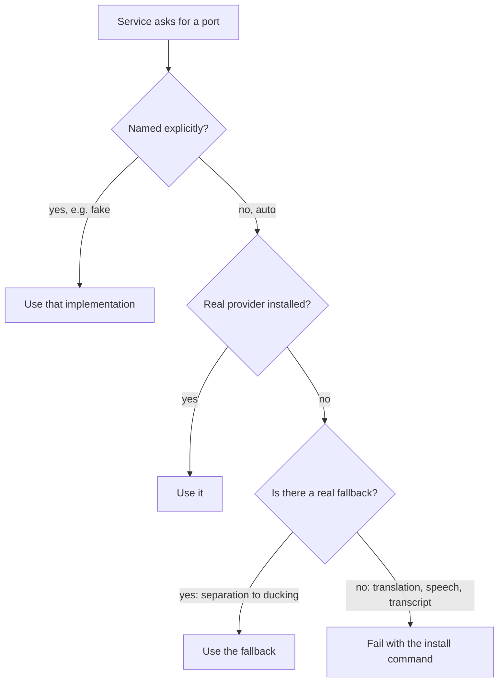

# GermanDubI architecture

This is the compact C4 view of the implemented `0.x` modular monolith. `vision.md` remains
the detailed target architecture; this document describes the code that exists today.

## System context

Network *model* providers are never selected implicitly. Source acquisition is the one
deliberate exception -- fetching a URL the user pasted is the point of the product -- and a
local file is inspected by a local provider that contacts nothing. The browser labels
provider kind so the reviewer can see whether text or media could leave the workstation.
See [ADR-0010](../adr/0010-local-providers-by-default.md).

## Containers

The API only queues commands and serves persisted state or media. The worker claims
persisted jobs and can be restarted without losing the pipeline graph. SQLite and the
artifact store are the coordination boundary; no in-memory queue is authoritative.

## Backend components

- `domain` owns projects, time-bounded speech segments, pipeline state, and invariants.
- `application` owns use cases, provider/repository ports, transactions, and invalidation.
- `infrastructure` owns SQLite, files, external processes, FFmpeg, and model adapters.
- `api`, `cli`, and `worker` are delivery mechanisms wired at composition roots.
- `frontend` is a thin state-aware client; TanStack Query holds server state and editor
  drafts remain component-local.

Dependencies point inwards only. The domain imports nothing from FastAPI, SQLAlchemy,
`yt-dlp` or FFmpeg, and the application depends on ports rather than on the adapters that
satisfy them. The executable boundary checks live in
`backend/tests/unit/test_architecture.py`.

## The pipeline

A run is a persisted dependency graph of sixteen stages, not one long function, so a run
can resume after a crash, a single stage can be re-run after an edit, and the effect of an
edit on everything downstream can be computed rather than guessed.

`align` only fills in word timing a transcript does not already carry: speech recognition
emits word timestamps as a by-product, while captions time a whole cue rather than the
words inside it.

## Concurrency and the database

One worker claims one job at a time. Projects are therefore dubbed one after another rather
than side by side, which is deliberate at this size: the models saturate the machine anyway,
and a second worker would contend for the same GPU.

What matters is how long the worker holds the database. SQLite allows one writer, so a
transaction left open across a stage locks out everything else -- and that is exactly what
used to happen. Recording that a stage had started took the write lock before a model had
even loaded, and held it for the whole stage. Adding a second video during a 123-second
transcription returned `500 database is locked`.

Three rules follow, and each is load-bearing:

- **A stage runs outside any open write transaction.** Claiming, announcing and recording
  are separate short transactions.
- **`checkpoint()` commits.** A stage that writes as it goes -- speech synthesis writes one
  artifact per segment -- would otherwise hold the lock throughout. Handlers already skip
  segments that have output from an earlier attempt, so committing early is work a retry
  reuses rather than work lost.
- **Cancellation is read on its own connection.** A reader never blocks a writer under WAL,
  which is what makes that safe; giving a *writer* its own connection deadlocks the process
  against itself, which was tried and reverted. It also has to be a separate read, because
  the stage's own transaction holds a snapshot from before the cancellation was written.

Cancelling reaches the process tree. The worker installs the same probe into the shared
process runner for the length of a stage, so stopping terminates the FFmpeg, yt-dlp or
Demucs process actually running instead of waiting for a checkpoint that a four-minute
external call never reaches.

Queued work is claimed oldest-first, with one exception: source inspection goes first. It
costs a second or two and is what someone who just pasted a URL is waiting on, where strict
age order put it behind every remaining stage of a dub already running.

## Provider selection

Selection is the registry's job alone. Everything else asks for a port and never learns
which implementation it received. Two things decide the answer: configuration, and the work
at hand -- the probe for a remote source is the downloader, the probe for a local file is
`ffprobe`.

The distinction in that last branch is the important one, and it was learned the hard way.

A missing separation model is a genuine degradation: the mix ducks the original audio
instead of removing it, which is a worse dub but still a dub. A missing translator or voice
is not a degradation at all. The placeholder providers exist for deterministic tests -- one
appends "ung" to English words, the other emits a quiet synthetic tone -- and a run that
used them completed every stage, reported success in the browser, and produced a
forty-minute video containing no German.

So the placeholders are never selected on a user's behalf. They are reachable only when
named explicitly, which is how the test suite and the browser E2E use them. In `auto` mode
their absence raises, and the error names the command that fixes it.

`germandubi doctor` follows the same rule: it reports readiness only when a real translator
and a real German voice are present, because FFmpeg alone is not enough to produce German.

The German voice is chosen per project rather than per machine, so two dubs on one
installation can use different narrators. `GET /voices` publishes the catalogue and
`GET /voices/{voice}/sample` speaks a cached sample of one, because a list of identifiers
like `de_DE-pavoque-low` cannot be chosen from by reading it.

This matters more than it looks, because the optional stacks are easy to lose: `uv sync
--locked`, which both `make install` and the quality gate run, removes them.
