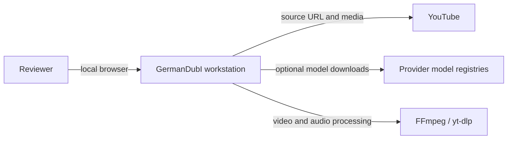
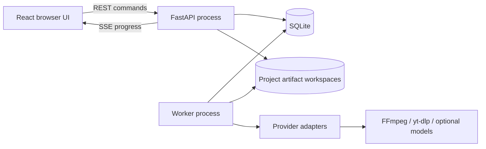

# GermanDubI architecture

This is the compact C4 view of the implemented `0.x` modular monolith. `vision.md` remains
the detailed target architecture; this document describes the code that exists today.

## System context



Network model providers are never selected implicitly. The browser labels provider kind so
the reviewer can see whether text or media could leave the workstation.

## Containers



The API only queues commands and serves persisted state or media. The worker claims
persisted jobs and can be restarted without losing the pipeline graph. SQLite and the
artifact store are the coordination boundary; no in-memory queue is authoritative.

## Backend components

```text
api / cli / worker  ->  application services  ->  domain
                              ^
                              |
                  infrastructure implements ports
```

- `domain` owns projects, time-bounded speech segments, pipeline state, and invariants.
- `application` owns use cases, provider/repository ports, transactions, and invalidation.
- `infrastructure` owns SQLite, files, external processes, FFmpeg, and model adapters.
- `api`, `cli`, and `worker` are delivery mechanisms wired at composition roots.
- `frontend` is a thin state-aware client; TanStack Query holds server state and editor
  drafts remain component-local.

The executable boundary checks live in `backend/tests/unit/test_architecture.py`.
