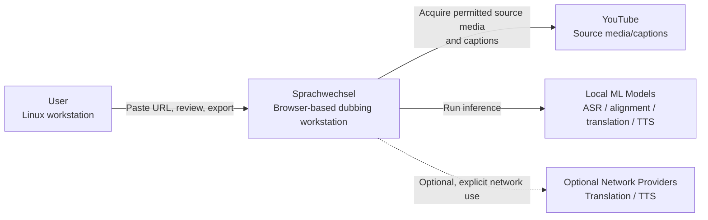
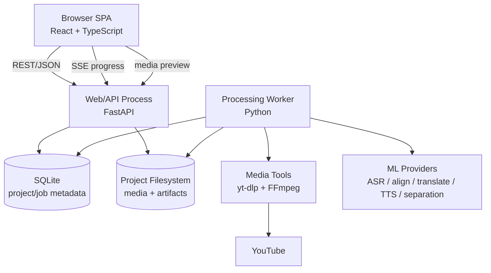
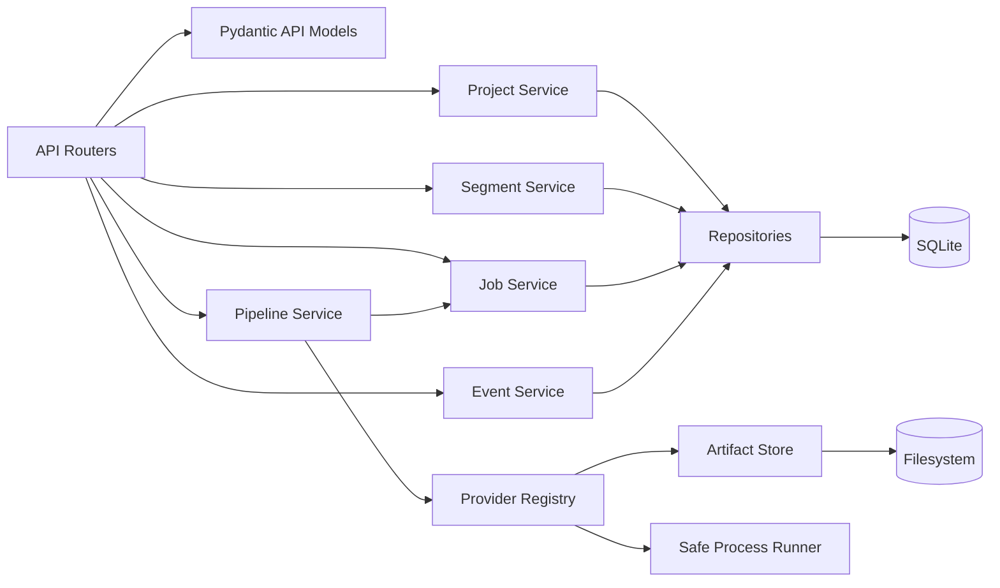
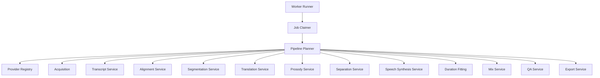
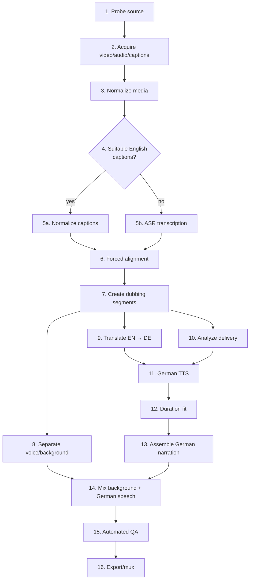
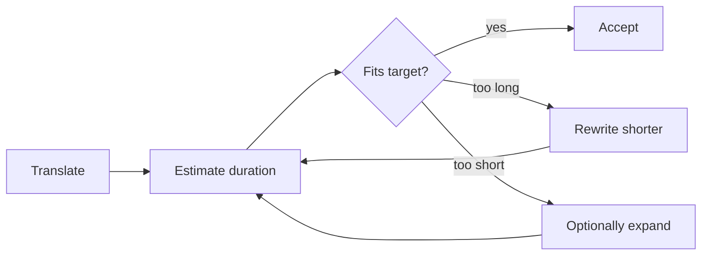
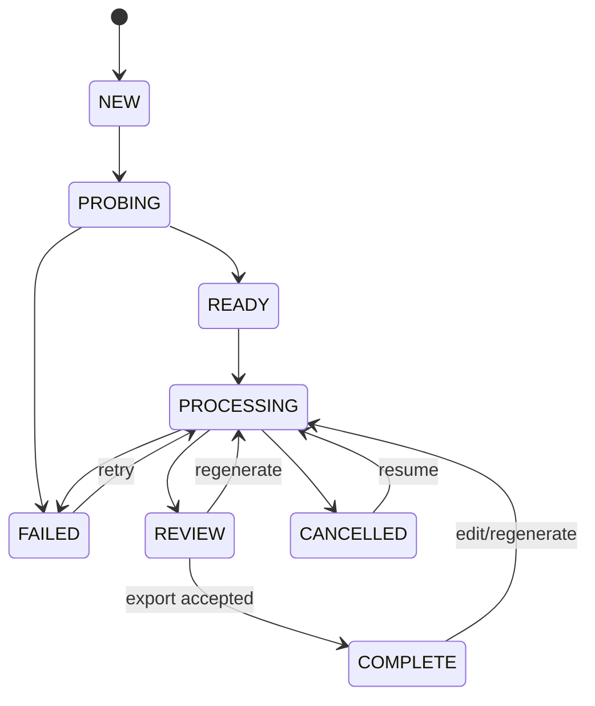

# Sprachwechsel — Product Vision and Technical Architecture

> **Document:** `vision.md`  
> **Status:** Draft architecture baseline  
> **Date:** 2026-08-30  
> **Primary platform:** Linux host, browser UI  
> **Backend:** Python  
> **Primary use case:** English single-narrator YouTube video → German dubbed video  
> **Working product name:** Sprachwechsel

---

## 1. Executive Summary

**Sprachwechsel** is a local-first, browser-based video dubbing workstation.

The initial experience should be deliberately simple:

1. Open `http://localhost:...` in a browser.
2. Paste a YouTube URL.
3. Press **Analyze**.
4. Press **Create German Dub**.
5. Watch the pipeline progress.
6. Preview the German result.
7. Optionally correct transcript/translation segments.
8. Regenerate only the affected segments.
9. Export a German-dubbed video.

The apparent simplicity of the UI hides a multi-stage media and machine-learning pipeline:

```text
YouTube URL
    ↓
Source inspection
    ↓
Video/audio/caption acquisition
    ↓
Transcript acquisition
    ├── existing captions
    └── ASR fallback
    ↓
Word-level alignment
    ↓
Dubbing segmentation
    ↓
English → German translation
    ↓
Duration optimization
    ↓
Narrator/prosody analysis
    ↓
German TTS
    ↓
Speech duration fitting
    ↓
Original voice/background separation
    ↓
Audio reconstruction and mixing
    ↓
Automated QA
    ↓
German video export
```

The system is designed as a **workstation**, not as an opaque one-shot AI script. Every significant intermediate artifact is persisted. A failed or manually edited segment can be regenerated without rerunning the whole video.

The architecture is intentionally modular. Downloading, transcription, alignment, translation, source separation, TTS, timing, and export are provider-backed capabilities behind application-owned interfaces. Models and services can therefore be replaced without rewriting the application.

The engineering baseline is part of the product from the first commit:

- source control and traceable versioning,
- a unique development version for every commit,
- SemVer release tags,
- locked dependencies,
- linting and formatting,
- strict static typing,
- unit, integration, API, contract, and browser E2E tests,
- deterministic test fixtures,
- continuous integration,
- dependency/security scanning,
- docstrings for public Python APIs,
- generated API documentation,
- C4 architecture documentation,
- Architecture Decision Records,
- structured logging,
- reproducible local development.

---

# 2. Product Vision

## 2.1 Vision statement

> **Paste an English video URL and obtain an editable, synchronized German dub while keeping every stage inspectable and reproducible.**

The application should make high-quality video localization approachable without hiding the complexity required for a good result.

The first target is intentionally narrow:

- English source language,
- German target language,
- one dominant narrator,
- occasional music or ambient background,
- Linux development/workstation environment,
- local browser frontend,
- local processing where practical.

This narrow scope lets us solve the genuinely difficult problems well:

- accurate timing,
- German duration constraints,
- removal/suppression of the English voice,
- natural German narration,
- resumability,
- manual correction when automation is imperfect.

---

# 3. Product Principles

## 3.1 Simple outside, explicit inside

The default UI should expose very few decisions:

```text
YouTube URL: [........................................]

Target:      German
Quality:     Balanced
Voice:       German Default

[ Analyze ]  [ Create German Dub ]
```

Internally, however, every stage should have explicit state and artifacts.

---

## 3.2 Non-destructive processing

Never destroy source media or previous intermediate results.

A project is an immutable source plus derived artifacts.

Editing a German sentence should create a new derivation of that segment rather than mutate unrelated results.

---

## 3.3 Segment-oriented architecture

The fundamental domain object is not the video and not the transcript.

It is a **time-bounded speech segment**.

A segment contains:

```text
timeline position
English text
word timestamps
German text
translation provenance
source prosody
German speech audio
synthesis provenance
duration fit
quality flags
```

This is the unit of:

- review,
- retry,
- caching,
- translation,
- synthesis,
- timing correction,
- QA.

---

## 3.4 Local-first, network-explicit

After acquiring source media and any required models, the default system should be capable of operating locally.

Providers must identify themselves as:

```text
LOCAL
NETWORK
```

If a network provider is selected, the UI must make clear what data can leave the machine:

- transcript text,
- reference audio,
- generated audio,
- project metadata.

---

## 3.5 Replaceable ML providers

No domain or application service should directly depend on a specific model implementation.

The architecture owns interfaces such as:

```text
TranscriptionProvider
AlignmentProvider
TranslationProvider
SourceSeparationProvider
ProsodyProvider
TTSProvider
DurationFittingProvider
```

The project must remain usable when one implementation becomes obsolete, changes license, breaks on a new CUDA version, or is replaced by a better model.

---

## 3.6 Human-correctable automation

A production-quality localization workflow cannot assume 100% automatic correctness.

The user must be able to correct:

- English transcript,
- segment boundaries,
- German translation,
- glossary terminology,
- German speech generation,
- timing.

Corrections should be cheap and local.

---

## 3.7 Reproducibility before cleverness

Every generated artifact records:

- application version,
- Git revision/build version,
- provider ID,
- model ID,
- model/version hash where practical,
- configuration,
- input content hash,
- creation timestamp.

Given the same source, configuration, deterministic provider, and model version, the system should be able to explain how an output was produced.

---

# 4. Primary User Journey

## 4.1 New project

The landing page contains one dominant action.

```text
┌───────────────────────────────────────────────────────┐
│ Sprachwechsel                                        │
│                                                       │
│ Turn an English narration into a German dub.         │
│                                                       │
│ YouTube URL                                           │
│ [ https://www.youtube.com/watch?v=................. ]│
│                                                       │
│                       [ Analyze ]                     │
└───────────────────────────────────────────────────────┘
```

`Analyze` performs a cheap probe before downloading large media.

The result shows:

- title,
- channel/uploader,
- duration,
- thumbnail,
- available English captions,
- whether captions are manual or automatic when detectable,
- source audio/video formats,
- estimated workflow,
- basic rights reminder.

---

## 4.2 Processing

After analysis:

```text
Target language: German
Quality:        Balanced
Voice:          German Default

[ Create German Dub ]
```

The processing screen exposes meaningful stage progress:

```text
✓ Source acquired
✓ Audio extracted
✓ English captions loaded
✓ Transcript aligned
✓ 192 dubbing segments created
✓ Background separation
● German translation          124 / 192
○ Narrator analysis
○ German speech
○ Timing optimization
○ Mixing
○ Quality checks
○ Export
```

Progress is streamed to the browser through Server-Sent Events.

---

## 4.3 Review

When the initial render is complete:

```text
┌─────────────────────────────────────────────────────────────┐
│ VIDEO PREVIEW                                               │
│                                                             │
│                    [ video player ]                         │
│                                                             │
│ Audio:  German ●   Original ○                               │
├─────────────────────────────────────────────────────────────┤
│ #   Time       English             German          Fit      │
│ 41  2:14-2:17  The important...    Entscheidend...  +2%    │
│ 42  2:17-2:22  In this case...     In diesem Fall.. +14% ⚠ │
│ 43  2:22-2:25  This means...       Das heißt...      ✓      │
└─────────────────────────────────────────────────────────────┘
```

Selecting a segment opens:

- original audio playback,
- English transcript,
- German translation,
- available duration,
- synthesized duration,
- duration mismatch,
- flags,
- actions.

Actions:

```text
Retranslate
Shorten German
Lengthen German
Regenerate speech
Play source
Play German
Approve
Reset
```

---

## 4.4 Export

The default output is an MKV containing:

- original video stream where possible without re-encoding,
- German audio track,
- original audio track,
- German subtitles,
- English subtitles.

A compatibility MP4 export can also be offered.

---

# 5. Scope

## 5.1 Version 0.x target

The prototype supports:

- Linux host,
- locally served web application,
- modern desktop browser,
- YouTube URL input,
- local file input shortly after the URL vertical slice,
- English speech,
- German output,
- one dominant narrator,
- optional background music,
- caption acquisition,
- ASR fallback,
- word-level timing,
- editable English transcript,
- editable German translation,
- stock German TTS,
- segment-level regeneration,
- basic background separation,
- synchronized audio reconstruction,
- video preview,
- MKV/MP4 export,
- persistent projects,
- resume after interruption.

---

## 5.2 Explicit non-goals for the first prototype

Do not initially optimize for:

- multi-user deployment,
- public SaaS hosting,
- user accounts,
- payments,
- distributed processing,
- Kubernetes,
- multiple simultaneous GPU workers,
- perfect lip synchronization,
- multiple speakers,
- translated on-screen text,
- arbitrary source sites,
- mobile UI,
- Windows/macOS packaging,
- automatic publication back to YouTube,
- perfect voice identity cloning.

These can be future capabilities, but including them in the initial architecture would slow the vertical slice.

---

# 6. Voice Identity and Authorization

There are two separate requirements that must remain separate in code and UI.

## 6.1 Prosody/style transfer

The system may analyze and reproduce delivery characteristics such as:

- speaking speed,
- pauses,
- sentence rhythm,
- relative energy,
- pitch movement,
- emphasis,
- calm/excited delivery.

This can be applied to a generic German voice.

Conceptually:

```text
German stock voice
+
original pacing/emphasis profile
=
style-aware German narration
```

This should be the first advanced voice feature.

---

## 6.2 Voice identity cloning

A provider may eventually synthesize a recognizable custom/reference voice.

This must be treated as an optional capability requiring authorization for the voice being reproduced.

The architecture should record authorization state separately from ordinary TTS configuration.

Example:

```yaml
voice_mode: reference_voice

authorization:
  confirmed: true
  type: user_owned_or_authorized
  confirmed_at: "..."
```

The initial MVP does not depend on voice cloning. This is deliberate: the rest of the application remains useful with ordinary German TTS.

---

# 7. Architectural Style

The recommended architecture is a **modular monolith with a separate worker process**.

That means:

- one repository,
- one backend codebase,
- one database,
- one domain model,
- one frontend,
- one local worker executable,
- clean internal boundaries.

It is **not** a microservice architecture.

A local media-processing prototype does not benefit from premature service decomposition.

The one process boundary we intentionally introduce is:

```text
HTTP API process
       ≠
heavy processing worker
```

The API stays responsive even during GPU/CPU-heavy work.

---

# 8. Selected Technology Stack

## 8.1 Backend

### Python

Use a currently supported Python 3.x release, pinned by project tooling and CI.

The exact minor version is an implementation decision recorded in `pyproject.toml`, not hard-coded into this vision document.

### FastAPI

Responsibilities:

- REST API,
- OpenAPI specification,
- input validation,
- dependency injection,
- SSE endpoints,
- project/segment operations,
- preview/download endpoints,
- health/version endpoints.

Heavy ML or FFmpeg work does **not** run inside request handlers.

FastAPI explicitly distinguishes lightweight background work from heavy computation that benefits from separate workers/processes.

---

## 8.2 Frontend

### React + TypeScript + Vite

The UI is intentionally thin, but a typed component architecture is justified because the intended product evolves naturally toward:

- media preview,
- progress streams,
- editable segment tables,
- filters,
- timing diagnostics,
- partial regeneration,
- keyboard navigation.

Recommended frontend characteristics:

- React,
- TypeScript in strict mode,
- Vite,
- generated TypeScript API types/client from backend OpenAPI,
- TanStack Query or a similarly small server-state layer,
- native browser video/audio elements where possible,
- no elaborate global state framework until real requirements justify it.

The backend is authoritative for project state.

---

## 8.3 Database

### SQLite for the single-user prototype

Use:

- SQLite,
- WAL mode where appropriate,
- SQLAlchemy 2.x,
- Alembic migrations.

SQLite is sufficient because the initial deployment model is one user, one workstation, and one active processing worker.

The database stores metadata and state, not large media blobs.

Future migration to PostgreSQL must be possible through repository abstractions, but should not be implemented prematurely.

---

## 8.4 Artifact storage

Use ordinary project directories on the filesystem.

Media belongs in files, not SQLite.

Example:

```text
data/projects/<project-id>/
├── source/
├── captions/
├── transcript/
├── stems/
├── translation/
├── speech/
├── mixes/
├── exports/
└── logs/
```

The database stores relative artifact paths, hashes, metadata, and lineage.

---

## 8.5 Processing worker

A separate Python process:

```text
python -m sprachwechsel.worker
```

The worker:

1. claims persisted jobs,
2. performs one stage,
3. writes artifacts,
4. records results transactionally,
5. emits progress events,
6. releases expensive resources,
7. claims the next stage.

For the first prototype there is one local worker.

Do **not** introduce Redis/Celery merely because a queue exists conceptually.

Define a `JobQueue` abstraction so a later Redis/broker implementation is possible.

---

## 8.6 Media tools

Use external command-line tools where they are already industry-standard:

- `yt-dlp` for supported source acquisition,
- `ffmpeg` / `ffprobe` for media inspection, extraction, muxing, transcoding, loudness handling, and basic audio filters.

Invoke external programs using argument arrays.

Never build shell commands by concatenating user input.

---

# 9. C4 Architecture

The following diagrams use ordinary Mermaid syntax so that they render in more environments than specialized Mermaid C4 extensions.

---

## 9.1 C4 Level 1 — System Context



### Context boundary

Sprachwechsel owns:

- project state,
- pipeline orchestration,
- artifacts,
- edits,
- quality checks,
- export.

It does not own:

- YouTube availability,
- external model licensing,
- remote provider uptime.

---

## 9.2 C4 Level 2 — Containers



### Container responsibilities

#### Browser SPA

- user interaction,
- project list,
- processing progress,
- video preview,
- transcript/translation editor,
- QA diagnostics,
- export controls.

#### API process

- validation,
- project lifecycle,
- REST resources,
- edit commands,
- job creation/cancel requests,
- SSE streaming,
- authorization boundary for local HTTP calls,
- version/health reporting.

#### Worker

- CPU/GPU-heavy operations,
- media subprocesses,
- ML inference,
- artifact generation,
- retries,
- job checkpoints.

#### SQLite

- projects,
- stages,
- jobs,
- segments,
- words,
- translations,
- generated speech versions,
- provider metadata,
- artifact metadata,
- events,
- migration version.

#### Project filesystem

- original media,
- normalized audio,
- subtitle source files,
- transcripts,
- stems,
- synthesized segment audio,
- mixes,
- exported video,
- technical logs.

---

## 9.3 C4 Level 3 — Backend Components



The API layer depends inward on application services.

Provider implementations depend on application-defined ports/interfaces, not the reverse.

---

## 9.4 C4 Level 3 — Processing Worker Components



---

# 10. Processing Pipeline

The pipeline is a persisted dependency graph, not one giant function.



---

# 11. Pipeline Stage Design

## 11.1 Source probe

Before downloading large media:

- validate URL,
- restrict accepted hosts for the initial prototype,
- ask `yt-dlp` for metadata,
- inspect captions,
- inspect available formats,
- obtain duration/title/thumbnail,
- reject obviously unsupported source,
- estimate disk usage where possible.

The source URL is data, never executable shell text.

---

## 11.2 Acquisition

Retrieve:

- best appropriate video stream,
- appropriate source audio,
- source metadata,
- English manual subtitles if available,
- English automatic captions if available.

Record exact source information in the project manifest.

A source checksum should be calculated after acquisition.

---

## 11.3 Audio normalization

Generate at least two audio forms.

### Master audio

Suitable for separation and final reconstruction.

Typical internal goal:

```text
48 kHz
stereo
PCM or high-quality lossless intermediate
```

### ASR audio

```text
16 kHz
mono
PCM
```

Avoid repeatedly decoding the video for later stages.

---

## 11.4 Transcript acquisition strategy

Priority:

1. creator-provided English captions,
2. YouTube automatic English captions,
3. local ASR.

Existing captions save computation but should not be blindly trusted as dubbing boundaries.

All transcript sources are normalized into the same internal model.

---

## 11.5 ASR fallback

The default local ASR adapter can use `faster-whisper`.

Useful capabilities include:

- local transcription,
- word timestamps,
- VAD integration,
- GPU/CPU execution modes.

The application must not expose `faster-whisper` objects outside its provider adapter.

Example application-owned output:

```python
@dataclass(frozen=True)
class RecognizedWord:
    text: str
    start_seconds: float
    end_seconds: float
    confidence: float | None
```

---

## 11.6 Forced alignment

For accurate dubbing, word timing matters more than subtitle display timing.

WhisperX is an initial candidate for an alignment provider because it explicitly performs forced alignment and exposes word-level timing.

Alignment is a replaceable stage because model support and behavior change over time.

The project should keep:

- original caption timing,
- ASR timing,
- aligned timing,

as separate provenance rather than silently overwriting one with another.

---

## 11.7 Dubbing segmentation

Do not synthesize an entire video as one speech file.

Create semantic dubbing segments using:

1. sentence boundaries,
2. long pauses,
3. clause boundaries,
4. breath/pause information,
5. minimum/maximum practical duration.

Typical target range:

```text
~1.5 to ~8 seconds
```

This is a heuristic, not a hard rule.

Segments should avoid splitting:

- names,
- numbers,
- article+noun units,
- short compound phrases.

---

## 11.8 Translation

Dubbing translation has two objectives:

```text
meaning
+
speakability inside the available time
```

Literal translation is insufficient.

For each segment provide the translator with:

- current English segment,
- previous source context,
- next source context,
- existing German context,
- project glossary,
- available duration,
- source speech rate/style,
- target register.

The translator returns:

```text
German text
translation metadata
estimated duration pressure
```

---

## 11.9 Duration-aware translation loop

A central feature of Sprachwechsel is iterative duration optimization.



After TTS exists, the loop can use actual synthesized duration:

```text
translate
→ synthesize
→ measure
→ rewrite if necessary
→ synthesize again
```

Preferred policy:

- mismatch ≤ 5%: small signal-level correction is acceptable,
- mismatch 5–12%: combine textual adjustment and small correction,
- mismatch > 12%: prefer rewrite/re-synthesis,
- extreme mismatch: flag for review.

Thresholds are configuration, not domain constants.

---

## 11.10 Glossary

Projects have a terminology glossary.

Example:

| English | German | Rule |
|---|---|---|
| machine learning | maschinelles Lernen | enforce |
| inference | Inferenz | enforce |
| rendering | Rendering | preferred |
| OpenAI | OpenAI | preserve |

The glossary is included in translation cache keys.

---

## 11.11 Prosody analysis

The first style feature should capture delivery rather than identity.

Per segment, derive approximate:

- speech rate,
- leading/trailing pause,
- energy,
- pitch mean/range,
- pitch contour,
- emphasis peaks.

Example domain representation:

```json
{
  "speech_rate_words_per_second": 2.61,
  "pause_before_ms": 280,
  "pause_after_ms": 510,
  "energy_relative": 0.64,
  "pitch_range_relative": 0.48
}
```

A global narrator profile can aggregate these values.

Not every TTS provider can consume every dimension. The information still helps segmentation, translation length, pause creation, mixing, and QA.

---

## 11.12 Source separation

A clean dub usually requires reducing or removing the English narrator.

Input:

```text
English narration + music + effects
```

Desired background stem:

```text
music + effects
```

A `SourceSeparationProvider` abstracts the implementation.

A Demucs-family provider can be experimented with for the prototype, but narration/background extraction is not guaranteed to be perfect and must not be architecturally tied to one model.

The system should calculate/report a rough separation-quality diagnostic.

Fallback when separation is poor:

- retain source mix at significantly reduced level during speech,
- overlay German speech,
- flag output as degraded.

The UI must not present poor separation as equivalent to a clean stem.

---

## 11.13 German TTS

`TTSProvider` is an application interface.

Minimal conceptual contract:

```python
class TTSProvider(Protocol):
    def synthesize(self, request: SpeechRequest) -> SpeechResult:
        ...
```

`SpeechRequest` includes:

- German text,
- language,
- voice ID,
- target duration hint,
- prosody hints,
- project/segment trace ID.

The initial default can be a local German TTS voice.

Custom/reference voice providers remain optional adapters.

---

## 11.14 Duration fitting

Signal-level time stretching is a correction mechanism, not the primary translation strategy.

The duration fitter:

1. compares source interval to generated speech,
2. decides whether rewriting should happen first,
3. performs bounded time correction,
4. checks artifacts,
5. records the ratio.

A per-segment UI indicator:

```text
0–5%       green
5–12%      amber
>12%       red
```

---

## 11.15 Timeline assembly

All fitted segment files are placed on a silent master timeline at their target positions.

Output:

```text
german_narration.wav
```

Individual segment files are preserved.

Editing one segment therefore requires:

```text
new translation/TTS for segment
→ update narration assembly
→ remix
```

not complete pipeline regeneration.

---

## 11.16 Mixing

Final mix:

```text
background stem
+
German narration
```

Optional operations:

- background ducking,
- speech EQ,
- gentle speech compression,
- loudness normalization,
- limiter/peak protection,
- fade handling at segment boundaries.

Preserve natural dynamics.

Do not normalize every sentence independently to identical loudness.

---

## 11.17 Subtitles

Generate:

- canonical English SRT/WebVTT,
- German SRT/WebVTT.

German subtitles should normally reflect the final spoken German text.

Manual changes to spoken translation update subtitle output.

---

## 11.18 Automated QA

Before final export, run deterministic checks.

Per segment:

- missing source text,
- missing translation,
- translation duration pressure,
- missing TTS,
- TTS duration mismatch,
- timeline overlap,
- clipping,
- suspicious silence,
- low ASR confidence.

Per project:

- unresolved failed jobs,
- missing source,
- missing export components,
- narration peak violations,
- timeline duration mismatch,
- untranslated segment count.

Example:

```text
192 speech segments

✓ 181 ready
⚠ 7 timing warnings
⚠ 3 low-confidence transcripts
✕ 1 synthesis failure

Background separation: ACCEPTABLE
Export status: BLOCKED by synthesis failure
```

Warnings need not always block export; hard failures should.

---

# 12. Pipeline State Model

## 12.1 Project state



---

## 12.2 Stage state

Each stage/job uses:

```text
PENDING
QUEUED
RUNNING
SUCCEEDED
FAILED
CANCEL_REQUESTED
CANCELLED
SKIPPED
INVALIDATED
```

A project state is derived from stage state and workflow intent.

---

# 13. Job Execution and Resumability

Every expensive operation is a persisted job.

Example:

```json
{
  "job_id": "01J...",
  "project_id": "01J...",
  "kind": "synthesize_segment",
  "segment_id": 87,
  "status": "SUCCEEDED",
  "attempt": 1,
  "input_hash": "sha256:...",
  "output_artifact_id": "01J...",
  "provider": "local_tts",
  "created_at": "...",
  "started_at": "...",
  "finished_at": "..."
}
```

The worker uses a claim/lease mechanism.

For one SQLite worker:

1. begin transaction,
2. atomically claim one eligible queued job,
3. commit,
4. perform work,
5. persist result.

A job should be safe to retry.

The pipeline is **idempotent by input hash**.

If inputs did not change and a valid artifact already exists, reuse it.

---

# 14. Cache and Invalidation

## 14.1 Translation cache key

Conceptually:

```text
hash(
    source text
    + source context
    + target language
    + glossary
    + translation provider
    + model/configuration
    + prompt/template version
)
```

---

## 14.2 TTS cache key

```text
hash(
    German text
    + voice ID
    + TTS provider/model
    + prosody controls
    + generation configuration
)
```

---

## 14.3 Dependency invalidation

If English transcript for segment 42 changes:

```text
segment 42 translation       INVALIDATED
segment 42 speech            INVALIDATED
German narration assembly    INVALIDATED
final mix                    INVALIDATED
export                       INVALIDATED
```

Unrelated segments remain valid.

This invalidation graph is a core application concern.

---

# 15. Data Model

Core entities:

```text
Project
SourceMedia
Artifact
PipelineRun
StageRun
Job
SpeechSegment
Word
TranslationRevision
SpeechRevision
VoiceProfile
GlossaryEntry
QualityFinding
Export
ProviderConfiguration
```

---

## 15.1 SpeechSegment

Representative fields:

```text
id
project_id
ordinal

start_ms
end_ms

source_text_current
source_text_source

transcription_source
transcription_confidence

translation_current

source_speech_rate
source_pause_before_ms
source_pause_after_ms
source_energy
source_pitch_profile

target_duration_ms
generated_duration_ms
duration_ratio

status
review_state
created_at
updated_at
```

Store time internally as integer milliseconds or another explicit integer unit, not binary floating-point seconds in the persistence model.

---

## 15.2 Revisions

Do not overwrite important human edits without history.

Store translation revisions:

```text
segment 42
  revision 1: machine translation
  revision 2: duration-shortened machine translation
  revision 3: user edit
```

Likewise for synthesized speech revisions.

The current revision is a pointer.

---

# 16. REST API

Prefix all API routes:

```text
/api/v1
```

Version the external API independently of the application build version.

---

## 16.1 Metadata

```text
GET /api/v1/meta
GET /api/v1/health
```

`/meta` returns:

```json
{
  "application": "sprachwechsel",
  "version": "0.2.1.dev17+gabc1234",
  "api_version": "v1",
  "git_revision": "abc1234",
  "dirty": false
}
```

---

## 16.2 Projects

```text
POST   /api/v1/projects
GET    /api/v1/projects
GET    /api/v1/projects/{project_id}
DELETE /api/v1/projects/{project_id}
```

Create request:

```json
{
  "source": {
    "type": "youtube",
    "url": "https://..."
  },
  "source_language": "en",
  "target_language": "de"
}
```

---

## 16.3 Source analysis

```text
POST /api/v1/projects/{id}/analyze
GET  /api/v1/projects/{id}/source
```

---

## 16.4 Pipeline

```text
POST /api/v1/projects/{id}/runs
GET  /api/v1/projects/{id}/runs/{run_id}
POST /api/v1/projects/{id}/runs/{run_id}/cancel
POST /api/v1/projects/{id}/runs/{run_id}/resume
```

---

## 16.5 Events

```text
GET /api/v1/projects/{id}/events
```

Content type:

```text
text/event-stream
```

SSE is preferred over WebSockets initially because communication is predominantly server → browser progress/state updates.

---

## 16.6 Segments

```text
GET   /api/v1/projects/{id}/segments
GET   /api/v1/projects/{id}/segments/{segment_id}
PATCH /api/v1/projects/{id}/segments/{segment_id}
```

Actions:

```text
POST /api/v1/projects/{id}/segments/{segment_id}/retranslate
POST /api/v1/projects/{id}/segments/{segment_id}/resynthesize
POST /api/v1/projects/{id}/segments/{segment_id}/approve
```

---

## 16.7 Preview and artifacts

```text
GET /api/v1/projects/{id}/preview/video
GET /api/v1/projects/{id}/preview/audio/original
GET /api/v1/projects/{id}/preview/audio/german
GET /api/v1/projects/{id}/artifacts
```

Implement HTTP range requests for large media preview where necessary.

Do not load entire video files into Python memory.

---

## 16.8 Export

```text
POST /api/v1/projects/{id}/exports
GET  /api/v1/projects/{id}/exports/{export_id}
```

---

# 17. Frontend Architecture

Suggested feature-based layout:

```text
frontend/
└── src/
    ├── app/
    │   ├── router/
    │   └── providers/
    ├── api/
    │   ├── generated/
    │   └── client.ts
    ├── features/
    │   ├── projects/
    │   ├── source-analysis/
    │   ├── processing/
    │   ├── segments/
    │   ├── preview/
    │   ├── exports/
    │   └── settings/
    ├── components/
    ├── hooks/
    ├── lib/
    └── main.tsx
```

Rules:

- API types are generated from FastAPI OpenAPI.
- Do not duplicate backend enums manually.
- Server state belongs in query/cache tooling.
- Component-local visual state stays local.
- Do not introduce Redux unless actual state complexity requires it.
- Accessible HTML controls first.
- Keyboard navigation is required for the segment editor.

---

# 18. Browser UI Pages

## 18.1 Home / New Project

- URL input,
- recent projects,
- Analyze action.

## 18.2 Source Analysis

- title/thumbnail/duration,
- caption availability,
- processing options,
- start action.

## 18.3 Processing

- pipeline stages,
- current stage,
- segment count,
- progress,
- log summary,
- cancel.

## 18.4 Review Editor

- video player,
- audio track selector,
- segment table,
- English/German editor,
- duration indicator,
- warnings,
- regenerate controls.

## 18.5 Export

- container,
- audio tracks,
- subtitles,
- output location/name,
- QA summary.

## 18.6 Settings

- hardware,
- provider choices,
- installed models,
- project storage,
- network-provider policy,
- advanced audio settings.

---

# 19. Backend Package Boundaries

Use dependency direction:

```text
presentation/API
      ↓
application
      ↓
domain

infrastructure/providers
      ↑
application ports
```

The domain layer does not import FastAPI, SQLAlchemy, yt-dlp, WhisperX, or FFmpeg.

Suggested Python structure:

```text
backend/
└── src/
    └── sprachwechsel/
        ├── domain/
        │   ├── entities/
        │   ├── value_objects/
        │   ├── events/
        │   └── errors.py
        │
        ├── application/
        │   ├── commands/
        │   ├── queries/
        │   ├── services/
        │   ├── ports/
        │   └── dto/
        │
        ├── infrastructure/
        │   ├── db/
        │   ├── artifacts/
        │   ├── jobs/
        │   ├── processes/
        │   └── providers/
        │
        ├── api/
        │   ├── routers/
        │   ├── schemas/
        │   ├── dependencies.py
        │   └── app.py
        │
        ├── worker/
        │   ├── runner.py
        │   └── handlers/
        │
        └── cli/
            └── main.py
```

This is not strict ceremonial Clean Architecture. It is a practical boundary system preventing infrastructure libraries from leaking everywhere.

---

# 20. Provider Interfaces

Provider adapters should be narrow.

Example:

```python
class TranscriptionProvider(Protocol):
    """Convert normalized source audio into a timed English transcript."""

    def transcribe(
        self,
        audio: AudioArtifact,
        *,
        language: LanguageCode,
        options: TranscriptionOptions,
    ) -> TranscriptResult:
        ...
```

Similarly:

```python
AlignmentProvider
TranslationProvider
ProsodyProvider
SourceSeparationProvider
TTSProvider
```

Provider results must immediately be mapped into application-owned data types.

Do not persist arbitrary third-party JSON as the canonical domain representation.

The raw provider result may still be preserved as a diagnostic artifact.

---

# 21. Safe External Process Boundary

Use one centralized process runner.

Responsibilities:

- argument arrays only,
- no shell by default,
- timeout support,
- cancellation,
- stdout/stderr capture,
- structured command metadata,
- redaction of sensitive values,
- exit-code validation,
- process-tree termination,
- bounded log storage.

Adapters for `ffmpeg` and `yt-dlp` use this runner.

This prevents dozens of inconsistent subprocess implementations.

---

# 22. YouTube Input Security

A URL input creates real security concerns.

For the first prototype:

- accept `https` only,
- explicitly allow known YouTube hostnames,
- reject credentials embedded in URLs,
- reject `file://`,
- reject localhost/private-network targets,
- do not provide arbitrary downloader arguments through the UI,
- sanitize generated filenames,
- keep all downloaded data inside the project workspace.

If arbitrary URL providers are added later, implement explicit SSRF protections.

Do not implement DRM/access-control circumvention.

Users are responsible for having rights to process and redistribute source content.

---

# 23. Application Versioning

Versioning is a first-class requirement.

## 23.1 Goals

Every running build must answer:

```text
Exactly which source revision produced me?
```

Every commit must have a unique, monotonically advancing **development version representation**.

Official releases use SemVer.

---

## 23.2 Release versions

Use Git tags:

```text
v0.1.0
v0.1.1
v0.2.0
v1.0.0
```

SemVer meaning:

- PATCH: fixes/internal improvements with compatible behavior,
- MINOR: backward-compatible functionality,
- MAJOR: incompatible stable API/project-format changes.

During `0.x`, project-format and API compatibility are still evolving and must be documented.

---

## 23.3 Every commit gets a version

Do **not** manually edit a `VERSION` file on every commit.

That creates noisy conflicts and commits whose only purpose is version bumping.

Instead derive versions from Git metadata using `setuptools-scm` or an equivalent VCS-backed mechanism.

Example:

```text
latest release tag:
0.2.1

17 commits later:
0.2.2.dev17+gabc1234
```

Next commit:

```text
0.2.2.dev18+gdef5678
```

Thus each commit receives a different development version without modifying source solely for version bookkeeping.

`setuptools-scm` explicitly derives versions from the latest tag, commit distance, revision, and dirty state.

---

## 23.4 Single source of version truth

The backend calculates the version.

The frontend receives the same version at build time and/or from:

```text
GET /api/v1/meta
```

Display in the UI footer:

```text
Sprachwechsel 0.2.2.dev18 (gdef5678)
```

Exports also record this version in project metadata.

---

## 23.5 Commit conventions

Use Conventional Commit style:

```text
feat: add caption probe
fix: preserve subtitle timing during normalization
refactor: isolate ffmpeg process runner
test: add failed-job resume scenario
docs: add container architecture
chore: update lock file
```

This provides structured change history and can later automate release notes.

A commit is not required to equal a public release.

---

# 24. Dependency Management

## 24.1 Python

Use `uv` with:

- `pyproject.toml`,
- committed `uv.lock`,
- dependency groups,
- reproducible CI sync.

The lockfile is committed.

Large ML provider dependencies can eventually be split into extras/groups if dependency conflicts appear.

Example concepts:

```text
core
dev
asr
alignment
separation
tts
```

Do not install every experimental ML stack into the API process environment if it creates incompatible CUDA/PyTorch requirements.

Worker/provider process isolation remains an escape hatch.

---

## 24.2 Frontend

Use a committed frontend lockfile.

Recommended:

```text
pnpm-lock.yaml
```

or a single agreed equivalent.

CI must use frozen-lockfile mode.

---

## 24.3 System dependencies

Detect and report:

- `ffmpeg`,
- `ffprobe`,
- `yt-dlp`,
- optional CUDA capability.

A first-start diagnostics page should make missing dependencies explicit.

---

# 25. Code Quality Toolchain

## 25.1 Python formatting

Use:

```bash
ruff format
```

CI:

```bash
ruff format --check
```

Ruff currently provides an integrated formatter intended to work alongside its linter.

---

## 25.2 Python linting

Use:

```bash
ruff check
```

Enable a deliberately chosen ruleset covering:

- pyflakes/pycodestyle-style correctness,
- import hygiene,
- modern Python upgrades,
- bugbear-style checks,
- docstring rules for public APIs,
- security-oriented rules where useful,
- simplification where it improves clarity.

Do not enable every rule indiscriminately.

---

## 25.3 Static typing

Use mypy in strict mode for application-owned Python modules:

```bash
mypy --strict backend/src
```

Third-party ML libraries often have incomplete typing. Keep ignores localized to provider adapters rather than weakening typing globally.

Mypy documentation explicitly recommends `--strict` as a strong target.

---

## 25.4 Frontend formatting/linting

Use:

```text
Prettier
ESLint
TypeScript strict mode
```

CI checks:

```text
prettier --check
eslint
tsc --noEmit
```

Avoid style debates by making formatting automatic.

---

## 25.5 Pre-commit

Install pre-commit hooks for fast checks:

- whitespace/end-of-file,
- YAML/TOML validity,
- Ruff lint,
- Ruff format check/fix as team policy,
- frontend formatting/lint,
- secret detection if adopted.

Do not run GPU integration tests in pre-commit.

---

# 26. Documentation Standards

Documentation is not postponed until after implementation.

---

## 26.1 Repository documentation

At minimum:

```text
README.md
vision.md
CONTRIBUTING.md
SECURITY.md
CHANGELOG.md
docs/
├── architecture/
├── adr/
├── development/
├── providers/
└── operations/
```

---

## 26.2 Python docstrings

All public application/domain APIs require docstrings.

Recommended style: Google-style or another single agreed format.

Docstrings should explain:

- purpose,
- domain semantics,
- important invariants,
- raised domain errors,
- non-obvious side effects.

Avoid comments that merely repeat code.

Example:

```python
def fit_segment_duration(
    audio: AudioArtifact,
    target_ms: int,
) -> DurationFitResult:
    """Fit synthesized speech to its allotted timeline interval.

    The fitter may perform bounded time scaling but does not rewrite text.
    Textual re-optimization must occur before this stage.

    Raises:
        InvalidDurationError: If ``target_ms`` is not positive.
    """
```

---

## 26.3 OpenAPI documentation

FastAPI generates the HTTP contract.

Every public endpoint must provide:

- explicit request/response models,
- status codes,
- meaningful operation IDs,
- error response models,
- summary/description.

The generated contract feeds the frontend client generation.

---

## 26.4 C4 diagrams

Keep C4 diagrams in version control.

Update them when container/component boundaries change materially.

`vision.md` contains the initial C4 baseline; later detailed architecture documents can split diagrams by concern.

---

## 26.5 Architecture Decision Records

Use ADRs for decisions that are expensive to reverse or easy to forget.

Initial ADR candidates:

```text
ADR-0001 Browser UI + Python API
ADR-0002 Modular monolith with separate worker
ADR-0003 SQLite for local single-user prototype
ADR-0004 Filesystem artifact store
ADR-0005 SSE for progress
ADR-0006 VCS-derived development versions
ADR-0007 Segment as core dubbing unit
ADR-0008 Provider interfaces for ML engines
ADR-0009 React/TypeScript thin frontend
ADR-0010 Local-first provider policy
```

ADR format:

```text
Context
Decision
Consequences
Alternatives considered
Status
```

---

# 27. Testing Strategy

Testing must distinguish deterministic application logic from expensive probabilistic ML behavior.

The test suite should be fast enough that developers actually run it.

---

## 27.1 Test pyramid

```text
                 ┌───────────────┐
                 │ Real-provider │
                 │ smoke tests   │
                 └───────┬───────┘
                 ┌───────▼───────┐
                 │ Browser E2E   │
                 └───────┬───────┘
             ┌───────────▼───────────┐
             │ Integration/API tests │
             └───────────┬───────────┘
         ┌───────────────▼───────────────┐
         │ Unit/property/golden tests    │
         └───────────────────────────────┘
```

Most tests should not download a model or access YouTube.

---

## 27.2 Unit tests

Use `pytest`.

Test:

- timestamp arithmetic,
- segment splitting,
- segment merging,
- duration ratios,
- state transitions,
- invalidation graph,
- job retry logic,
- URL validation,
- file path safety,
- translation prompt construction,
- glossary behavior,
- QA rules,
- artifact hashing,
- version parsing.

---

## 27.3 Property-based tests

Use Hypothesis where it provides value.

Excellent candidates:

- arbitrary valid timestamp sequences,
- segment ordering,
- no-negative-duration invariants,
- split/merge round trips,
- subtitle serialization,
- path/name sanitization.

Example invariant:

```text
for every segment:
    start_ms >= 0
    end_ms > start_ms
```

Project invariant:

```text
segments are sorted by start time
```

---

## 27.4 Golden-file tests

Use small text/media fixtures for transformations where exact expected output matters.

Examples:

- WebVTT → canonical transcript JSON,
- canonical transcript → SRT,
- FFmpeg command plans,
- translation context assembly,
- project manifest serialization.

Golden files must be small and reviewed like code.

---

## 27.5 Provider contract tests

Every provider implementation must pass a common behavior suite.

Example TTS contract:

```text
given valid German text
→ returns an audio artifact
→ duration > 0
→ declared sample rate exists
→ provenance is populated
```

Fake providers run in normal CI.

Real-provider contract tests run separately.

---

## 27.6 API tests

FastAPI supports direct test clients based on HTTPX/Starlette.

API tests cover:

- create project,
- validation errors,
- analyze request,
- start run,
- cancel run,
- list segments,
- patch translation,
- regenerate segment,
- version endpoint,
- artifact access restrictions.

These tests should use an isolated temporary SQLite database and temporary artifact root.

---

## 27.7 Worker integration tests

Use fake deterministic providers.

Example scenario:

```text
create project
→ enqueue pipeline
→ worker claims jobs
→ fake transcript emitted
→ fake translation emitted
→ fake speech WAV emitted
→ fake/real lightweight mix
→ project reaches REVIEW
```

This proves orchestration without invoking a giant ASR model.

---

## 27.8 Browser E2E tests

Use Playwright.

Playwright's pytest integration supports modern browser engines and headless CI execution.

Core E2E scenario:

```text
open UI
→ paste fixture URL
→ analyze
→ start dub
→ observe progress
→ review project
→ edit German segment
→ regenerate
→ export
```

For normal CI, network/AI providers are mocked or replaced by deterministic local fakes.

Other E2E cases:

- invalid URL,
- cancellation,
- worker failure,
- retry,
- browser refresh during processing,
- reopening completed project.

---

## 27.9 Real-provider smoke tests

Real ASR/TTS/separation tests are valuable but should not gate every commit.

Run:

- manually,
- nightly,
- on a dedicated GPU runner,
- before release candidates.

Use a tiny owned test clip.

The clip should include:

- ~60–90 seconds,
- one English narrator,
- pauses,
- quiet music,
- a proper name,
- a number,
- at least one short and one long sentence.

Never make CI depend on an arbitrary live YouTube video.

---

## 27.10 Media assertions

Useful deterministic checks:

```text
output file exists
output duration is within tolerance
audio stream exists
video stream exists
German subtitle stream exists
no obvious clipping
segment placement is monotonic
```

Use `ffprobe` in integration tests.

---

# 28. Test Coverage Policy

Coverage is a diagnostic, not the goal.

Initial thresholds can be:

```text
domain/application code: high coverage target
infrastructure adapters: meaningful path coverage
generated code: excluded
UI: behavior covered by component/E2E tests
```

A practical repository-wide floor might start around 80% and tighten only where it adds value.

Critical domain algorithms should be much closer to exhaustive branch coverage.

Do not write meaningless tests solely to satisfy a percentage.

---

# 29. Continuous Integration

Every pull request/commit to the main integration branch should run a deterministic CI pipeline.

Suggested stages:

```text
1. metadata/version check
2. dependency integrity
3. Python formatting
4. Python linting
5. Python type checking
6. frontend formatting
7. frontend linting
8. frontend type checking
9. unit tests
10. API/integration tests
11. frontend unit/component tests
12. Playwright E2E with fake providers
13. build backend package
14. build frontend
15. security/dependency audit
```

Jobs that can run independently should run in parallel.

GPU tests are separate.

---

# 30. Continuous Integration Quality Gates

A commit cannot merge when:

- formatter check fails,
- lint fails,
- mypy fails,
- TypeScript fails,
- required tests fail,
- migrations are inconsistent,
- generated API client is stale,
- lockfiles are stale,
- dependency audit hits configured blocking severity,
- version metadata cannot be derived.

The goal is that `main` is always runnable.

---

# 31. Security and Dependency Scanning

Minimum baseline:

- dependency vulnerability scan,
- secret scanning,
- safe subprocess wrapper,
- input validation,
- path traversal tests,
- output file sandboxing.

For Python, use a PyPA-compatible audit tool such as `pip-audit` or the selected equivalent.

For frontend dependencies, use the package manager's audit/security mechanism plus repository dependency tooling.

Security warnings from experimental ML dependencies need explicit triage rather than blanket ignoring.

---

# 32. Source Control Workflow

Recommended initial workflow:

```text
main
  ↑
short-lived feature branches
```

Rules:

- small coherent commits,
- Conventional Commit messages,
- PR review when more than one developer is involved,
- CI required,
- squash/rebase policy chosen once and documented,
- no generated media committed,
- no model weights committed,
- lockfiles committed,
- database migrations committed,
- ADRs committed.

For a one-developer prototype, the same CI gates still provide value.

---

# 33. Release Process

A release is not every commit.

Every commit already has an automatically derived development version.

A public/internal release:

1. ensure main is green,
2. update `CHANGELOG.md`,
3. choose SemVer version,
4. create annotated Git tag,
5. CI builds artifacts,
6. run release smoke tests,
7. publish/archive release artifact.

Example:

```text
commit builds:
0.4.0.dev1
0.4.0.dev2
...
0.4.0.dev37

release:
0.4.0
```

---

# 34. Project File Format Version

Application version and project schema version are different.

Store:

```json
{
  "project_format_version": 3,
  "created_with": "0.4.0.dev17+gabc1234"
}
```

When schema changes:

- migrate DB with Alembic,
- migrate project metadata/artifact manifests explicitly if necessary,
- preserve backups for destructive migrations.

Never infer project compatibility solely from application SemVer.

---

# 35. Observability

A local app still needs observability.

## 35.1 Structured logs

Use structured logging fields:

```text
timestamp
level
project_id
run_id
job_id
segment_id
stage
provider
duration_ms
message
```

User-facing log and technical log are different views.

---

## 35.2 Metrics

Initially record locally:

- job duration,
- stage duration,
- provider duration,
- cache hit rate,
- synthesized seconds,
- failed segment count,
- retry count,
- GPU/CPU mode,
- final processing ratio versus source duration.

No telemetry needs to leave the machine by default.

---

## 35.3 Correlation IDs

Every pipeline run and job gets IDs propagated through logs and events.

A user report should be able to say:

```text
Project: 01J...
Run:     01J...
Job:     01J...
```

and the developer can find the exact failure.

---

# 36. Failure Handling

Failures are expected in media/ML workflows.

A stage failure must:

1. mark the job failed,
2. preserve completed artifacts,
3. store human-readable summary,
4. store technical details,
5. release GPU/process resources,
6. leave project resumable.

Bad UI:

```text
Error: process exited 1
```

Good UI:

```text
German speech generation failed for segment 87.

The other 191 segments are preserved.

[ Retry ]
[ Choose another voice ]
[ Technical details ]
```

---

# 37. Cancellation

Cancellation is a product feature, not an exception.

User presses Cancel:

```text
RUNNING
→ CANCEL_REQUESTED
→ worker reaches safe boundary
→ terminates subprocess/model task
→ CANCELLED
```

Completed outputs remain cached.

Resume continues from valid artifacts.

---

# 38. Resource Management

Only one expensive GPU stage should own the GPU at a time in the initial worker.

Typical sequence:

```text
load ASR
run ASR
release ASR

load alignment
run alignment
release alignment

load separation
run separation
release separation

load translation
run translation
release translation

load TTS
run TTS batch
release TTS
```

Provider lifecycle is explicit.

Do not rely solely on Python garbage collection to free GPU resources.

---

# 39. Hardware Detection

Diagnostics should report:

```text
Operating system
Python version
FFmpeg
yt-dlp
CPU
RAM
GPU
CUDA availability
VRAM
free disk
installed providers/models
```

The application maps this to a quality profile.

---

# 40. Quality Profiles

Expose user-oriented presets instead of model jargon.

## Fast

- existing captions strongly preferred,
- smaller/faster ASR fallback,
- basic alignment,
- local standard translation,
- basic TTS,
- lighter separation.

## Balanced

- strong ASR fallback,
- forced alignment,
- duration-aware translation,
- source separation,
- iterative TTS fit.

## Maximum

- stronger provider configuration,
- multiple translation candidates where useful,
- more iterations of duration optimization,
- stronger QA,
- enhanced prosody handling.

The exact model names remain in advanced settings.

---

# 41. Repository Layout

Recommended monorepo:

```text
sprachwechsel/
├── README.md
├── vision.md
├── CHANGELOG.md
├── CONTRIBUTING.md
├── SECURITY.md
├── LICENSE
├── pyproject.toml
├── uv.lock
├── Makefile
├── .editorconfig
├── .pre-commit-config.yaml
├── .gitignore
│
├── backend/
│   ├── src/
│   │   └── sprachwechsel/
│   │       ├── domain/
│   │       ├── application/
│   │       ├── infrastructure/
│   │       ├── api/
│   │       ├── worker/
│   │       └── cli/
│   └── tests/
│       ├── unit/
│       ├── integration/
│       ├── contract/
│       └── fixtures/
│
├── frontend/
│   ├── package.json
│   ├── pnpm-lock.yaml
│   ├── tsconfig.json
│   ├── vite.config.ts
│   ├── src/
│   └── tests/
│
├── e2e/
│   ├── tests/
│   └── fixtures/
│
├── docs/
│   ├── architecture/
│   ├── adr/
│   ├── development/
│   ├── providers/
│   └── operations/
│
├── scripts/
│   ├── dev
│   ├── check
│   ├── test
│   └── version
│
└── data/
    └── .gitkeep
```

Actual user project data should default outside the Git checkout.

---

# 42. Developer Commands

Provide a small, stable command surface.

Whether implemented by Make, `just`, or scripts is secondary; choose one.

Example:

```bash
make dev
make worker
make test
make test-unit
make test-e2e
make lint
make format
make typecheck
make check
make docs
make version
```

`make check` should approximate CI locally.

---

# 43. Local Development Experience

Target setup:

```bash
git clone ...
cd sprachwechsel

uv sync --all-groups
corepack enable
pnpm install --frozen-lockfile

make dev
```

Processes:

```text
FastAPI dev server
Vite dev server
processing worker
```

A development supervisor script can launch all three.

The production-like local build can have FastAPI serve the compiled frontend.

---

# 44. Database Migrations

Use Alembic from the first schema.

Rules:

- no manual production schema editing,
- every model schema change gets a migration,
- CI creates an empty DB and upgrades to head,
- CI can optionally test downgrade for reversible migrations,
- migration filenames/IDs are reviewed.

---

# 45. Media Test Fixtures

Keep small owned test fixtures.

Recommended:

```text
fixtures/
├── narrator_10s.wav
├── narrator_music_20s.wav
├── tiny_video_30s.mp4
├── captions_manual.en.vtt
├── captions_auto.en.vtt
└── expected/
```

Avoid checking in large media.

Use Git LFS only if fixtures genuinely require it; prefer tiny conventional files first.

---

# 46. Deterministic Fake Providers

Create fake implementations immediately:

```text
FakeTranscriptionProvider
FakeAlignmentProvider
FakeTranslationProvider
FakeTTSProvider
FakeSeparationProvider
```

Example:

`FakeTranslationProvider` maps fixed English fixture strings to German fixture strings.

`FakeTTSProvider` creates a deterministic sine/silence WAV of known duration.

These providers are essential because they let us test the entire product flow without GPU models.

---

# 47. Initial CLI

Even though the main interface is the browser, expose a developer CLI.

Examples:

```bash
sprachwechsel doctor
sprachwechsel version
sprachwechsel worker
sprachwechsel process ./sample.mp4
sprachwechsel inspect <project-id>
```

The CLI uses the same application services as the API.

It is a debugging and automation surface, not a second implementation.

---

# 48. Automated Architecture Checks

Some architectural constraints can be tested.

Examples:

- domain package may not import FastAPI,
- domain package may not import SQLAlchemy,
- application package may not import provider implementation modules,
- no API router invokes `subprocess` directly.

Use an import-linter/architecture test or ordinary test code to enforce these boundaries.

Architecture documentation is stronger when the dependency rules are executable.

---

# 49. Performance Model

The application should report processing performance as:

```text
processing factor = processing time / video duration
```

Example:

```text
20-minute video
10-minute processing
factor = 0.5x realtime
```

Track by stage.

This creates objective performance data for future optimization.

---

# 50. Concurrency Strategy

Initial version:

```text
1 API process
1 worker
1 GPU-heavy job at a time
```

Potential parallel work:

- cheap database/API operations,
- some CPU preprocessing,
- independent segment TTS if resources permit later.

Do not parallelize merely because segments are independent. GPU memory and model loading often dominate.

Batch where providers support it efficiently.

---

# 51. Frontend Progress Transport

Use SSE for progress.

Why:

- one-way server → browser data fits the problem,
- automatic browser reconnection behavior,
- simpler than maintaining a bidirectional WebSocket protocol,
- normal REST remains the command channel.

Event example:

```text
event: job-progress
data: {
  "run_id": "...",
  "stage": "translation",
  "completed": 124,
  "total": 192
}
```

Browser refresh should reconstruct current state from REST and then reconnect to SSE.

Never rely on transient events as the only state store.

---

# 52. Preview Strategy

The browser should preview generated media without a separate rendering service.

Approach:

- FastAPI exposes range-capable artifact routes,
- browser uses native `<video>`,
- German preview audio can be muxed into a low-cost preview file or selected from project export,
- individual segments use lightweight audio routes.

Generate low-resolution preview only if original codecs are not browser-compatible.

The final export may remain in a higher-quality container.

---

# 53. Translation Provider Strategy

Translation is provider-backed.

Initial candidates can include:

- local translation model,
- local LLM,
- optional remote LLM/API.

A provider advertises capabilities:

```json
{
  "id": "example",
  "network": false,
  "supports_context": true,
  "supports_duration_instruction": true,
  "license": {
    "commercial_use": true,
    "attribution": false
  }
}
```

Provider/model licensing is surfaced in Settings.

Do not treat model licenses as hidden implementation trivia.

---

# 54. Model Registry

Maintain an internal registry:

```text
provider
capability
model
version
source
license
network/local
hardware requirements
installed state
checksum
```

The UI can later show:

```text
ASR model                  Installed
English alignment model    Installed
German translation model   Installed
German voice               Installed
Separation model           Missing
```

---

# 55. Model Downloads

Model installation is separate from application installation.

Store outside repository:

```text
~/.local/share/sprachwechsel/models/
```

or the relevant XDG data directory.

Record model checksums when possible.

Do not commit weights.

---

# 56. Artifact Lineage

Each artifact record should answer:

```text
What generated this?
From what inputs?
Using which provider/configuration?
```

Example:

```json
{
  "artifact": "speech/fitted/000087.wav",
  "kind": "FITTED_SPEECH",
  "sha256": "...",
  "derived_from": [
    "translation-revision:...",
    "speech-revision:..."
  ],
  "producer": {
    "application_version": "0.4.0.dev17+gabc1234",
    "provider": "tts-local",
    "model": "..."
  }
}
```

---

# 57. Privacy Boundary

Default behavior:

- no analytics,
- no transcript upload,
- no audio upload,
- no external inference.

When a network provider is configured, show a one-time explicit notice and retain provider configuration per project/run.

A project export should not accidentally include credentials or tokens.

---

# 58. Configuration

Configuration hierarchy:

```text
built-in defaults
↓
user settings
↓
project settings
↓
pipeline-run overrides
```

Use typed configuration.

Secrets are not stored in ordinary project JSON.

Use environment variables or a later OS keyring integration for provider credentials.

---

# 59. Error Taxonomy

Use application-level error categories:

```text
SourceValidationError
SourceAcquisitionError
MediaProcessingError
CaptionError
TranscriptionError
AlignmentError
TranslationError
SeparationError
SynthesisError
DurationFitError
MixError
ExportError
ConfigurationError
ResourceError
CancelledError
```

Infrastructure exceptions are wrapped with domain/application context.

This creates stable UI behavior even when third-party libraries change exception types.

---

# 60. Documentation Site

As the project grows, generate a local docs site from Markdown.

Good fit:

```text
MkDocs
```

or an equivalent static documentation system.

Sections:

- getting started,
- architecture,
- developer setup,
- processing pipeline,
- provider development,
- testing,
- troubleshooting,
- release/versioning,
- security/privacy.

`vision.md` remains the high-level north-star document.

---

# 61. Definition of Done for a Feature

A feature is not done when the happy-path code exists.

For ordinary application features, Definition of Done includes where applicable:

- implementation,
- type annotations,
- public docstrings,
- unit tests,
- integration/API tests,
- E2E change if user-visible workflow changed,
- migration if persistence changed,
- docs updated,
- C4/ADR updated if architecture changed,
- lint/format/typecheck clean,
- no new untriaged security warning,
- changelog entry for release-relevant behavior.

---

# 62. Initial CI Matrix

A practical first matrix:

## Backend quality

```text
ruff format --check
ruff check
mypy --strict
pytest backend/tests/unit
pytest backend/tests/integration
```

## Frontend quality

```text
prettier --check
eslint
tsc --noEmit
frontend tests
```

## E2E

```text
API + worker fake providers
Vite/compiled frontend
Playwright Chromium
```

Run Firefox/WebKit periodically or once CI cost remains acceptable.

## Build

```text
backend package builds
frontend production build
OpenAPI client generation produces no diff
```

---

# 63. CI Test Environment

Normal CI must not need:

- GPU,
- YouTube,
- paid APIs,
- multi-gigabyte models.

Instead:

```text
Fake ASR
Fake translation
Fake TTS
Fake separation
real SQLite
real FastAPI
real worker
real frontend
real browser
small local media fixtures
```

This gives deterministic end-to-end coverage.

---

# 64. Real Pipeline Validation

A separate workflow validates actual media/ML providers.

Possible cadence:

```text
nightly
manual dispatch
release candidate
```

Results are reported but can initially be non-blocking because third-party models/hardware are less deterministic.

Promote specific smoke tests to release gates once stable.

---

# 65. First Implementation Milestones

## Milestone 0 — Repository foundation

Goal: an empty application with professional engineering foundations.

Deliver:

- repository layout,
- backend package,
- frontend app,
- FastAPI health endpoint,
- React landing page,
- worker process skeleton,
- SQLite/Alembic baseline,
- VCS-derived version endpoint,
- Ruff,
- mypy strict,
- pytest,
- ESLint/Prettier/TypeScript strict,
- Playwright,
- pre-commit,
- CI,
- `vision.md`,
- initial C4,
- ADR directory,
- sample fixtures.

Acceptance:

```text
make check
```

passes on a clean checkout.

---

## Milestone 1 — Project + source probe

Goal:

```text
paste URL
→ Analyze
→ show source metadata
```

Deliver:

- project creation,
- URL validation,
- yt-dlp probe adapter,
- source metadata persistence,
- source analysis UI,
- fake-source provider for tests.

No large download required yet.

---

## Milestone 2 — Acquisition + transcript

Goal:

```text
URL
→ media
→ English timed transcript
```

Deliver:

- source acquisition,
- normalized audio,
- caption detection,
- caption normalization,
- ASR fallback,
- transcript UI,
- transcript artifact.

---

## Milestone 3 — Alignment + segments

Goal:

```text
English transcript
→ reliable editable dubbing segments
```

Deliver:

- word timing,
- segment generation,
- segment persistence,
- segment editor,
- confidence warnings.

---

## Milestone 4 — Translation

Goal:

```text
English segments
→ German editable segments
```

Deliver:

- translation provider interface,
- one local/default provider,
- context handling,
- glossary,
- duration estimate,
- retranslate action,
- revision history.

---

## Milestone 5 — German speech

Goal:

```text
German segment
→ German audio
```

Deliver:

- TTS interface,
- default German voice,
- segment speech artifacts,
- resynthesize action,
- browser audio preview.

At this milestone the app can produce a German narration track even before sophisticated background reconstruction.

---

## Milestone 6 — Timeline + export vertical slice

Goal:

```text
source video
+
German narration
→ playable German output
```

Deliver:

- narration assembly,
- basic mix,
- subtitles,
- MKV/MP4 export,
- browser preview.

This is the first complete product loop.

---

## Milestone 7 — Source separation

Goal:

```text
reduce/remove English voice
while preserving background
```

Deliver:

- separation provider,
- background stem,
- fallback attenuation strategy,
- separation QA,
- source/background preview.

This is likely the single largest quality improvement after the vertical slice.

---

## Milestone 8 — Duration-aware dubbing

Deliver:

- synthesized-duration feedback,
- automatic German shortening/expansion,
- bounded time fitting,
- mismatch warnings,
- timeline validation.

---

## Milestone 9 — Prosody-aware narration

Deliver:

- speaking-rate analysis,
- pause analysis,
- energy profile,
- TTS prosody hints where provider supports them,
- improved pause reconstruction.

---

## Milestone 10 — Authorized custom/reference voice

Only after the core pipeline is stable:

- voice reference management,
- authorization state,
- optional provider,
- reference quality checks,
- provider/license metadata.

---

# 66. Successful Prototype Definition

The prototype is successful when a new developer can:

```text
clone repository
→ install documented dependencies
→ run make dev
→ open browser
→ paste supported YouTube URL
→ analyze
→ process
→ obtain English transcript
→ obtain German translation
→ obtain German speech
→ preview German video
→ edit one German segment
→ regenerate only that segment
→ export final video
→ close application
→ restart
→ reopen project without recomputing valid stages
```

And the project simultaneously satisfies:

```text
formatting clean
lint clean
static typing clean
unit tests green
API/integration tests green
E2E tests green
version visible
documentation present
architecture diagrams current
```

---

# 67. What Not to Optimize Too Early

Avoid early work on:

- beautiful waveform visualization,
- plugin marketplaces,
- cloud accounts,
- distributed workers,
- Kubernetes,
- multiple database services,
- frame-level lip sync,
- dozens of languages,
- dozens of source sites,
- elaborate theme systems,
- high-end voice cloning before timing/mixing works.

The quality bottlenecks will initially be:

1. removing the source narrator cleanly,
2. creating natural German text that fits,
3. generating good German speech,
4. preserving timing,
5. robust resumability.

---

# 68. Key Risks

## 68.1 Source separation quality

Risk:

English speech leaks into the final background.

Mitigation:

- provider abstraction,
- QA preview,
- fallback ducking,
- later investigate dedicated dialogue-removal models.

---

## 68.2 German duration mismatch

Risk:

German translations are longer than available timing.

Mitigation:

- duration-aware translation,
- synthesis feedback loop,
- bounded time scaling,
- review flags.

---

## 68.3 ML dependency conflicts

Risk:

ASR, separation, and TTS require incompatible PyTorch/CUDA stacks.

Mitigation:

- strict provider boundaries,
- keep heavy work out of API process,
- dependency groups,
- optional provider subprocess isolation later.

---

## 68.4 Model/license changes

Risk:

A model suitable for experimentation cannot be shipped or used commercially.

Mitigation:

- provider/model registry,
- license metadata,
- no hard architectural dependency on one model.

---

## 68.5 YouTube/source behavior changes

Risk:

Source extraction breaks.

Mitigation:

- isolated acquisition adapter,
- provider contract,
- local file input,
- dependency updates independent from domain logic.

---

## 68.6 Nondeterministic AI output

Risk:

Tests become flaky.

Mitigation:

- deterministic fake providers for CI,
- golden fixtures,
- separate real-provider smoke suite.

---

## 68.7 Overengineering

Risk:

The architecture becomes larger than the product.

Mitigation:

- modular monolith,
- one worker,
- SQLite,
- filesystem artifacts,
- no broker until needed,
- vertical slice milestones.

---

# 69. Key Architectural Decisions

The following should be treated as the initial architecture baseline.

1. **Browser-first prototype rather than native desktop UI.**
2. **Python FastAPI backend.**
3. **React + TypeScript thin frontend.**
4. **Separate processing worker from HTTP server.**
5. **Modular monolith, not microservices.**
6. **SQLite for local single-user state.**
7. **Filesystem for media/artifacts.**
8. **SSE for progress; REST for commands.**
9. **Segment is the core editing/caching unit.**
10. **Provider abstraction around all ML engines.**
11. **Existing captions preferred; ASR is fallback.**
12. **Forced alignment is explicit.**
13. **Translation is duration-aware.**
14. **Speech/background separation is a first-class stage.**
15. **Voice identity and prosody are separate concepts.**
16. **Custom voice synthesis is optional and authorization-aware.**
17. **Every artifact has provenance and hashes.**
18. **Every commit receives a VCS-derived development version.**
19. **Public releases use SemVer tags.**
20. **CI does not depend on GPU or public network services.**

---

# 70. Recommended First Vertical Slice

Before sophisticated AI quality work, prove the architecture using fake providers plus one real media pipeline.

The first vertical slice should be:

```text
Browser
   ↓
create project
   ↓
local tiny fixture video
   ↓
fake transcript
   ↓
fake German translation
   ↓
fake/simple German speech artifact
   ↓
FFmpeg mux
   ↓
browser preview
```

Then substitute one real provider at a time:

```text
real source acquisition
real transcript
real alignment
real translation
real TTS
real separation
```

This approach isolates integration failures and prevents five model stacks from being debugged simultaneously.

---

# 71. Recommended Development Order

The first commits should roughly create:

```text
01 repository/tooling/version foundation
02 backend health/meta API
03 frontend shell
04 SQLite/Alembic project model
05 persisted job model
06 worker loop
07 SSE progress
08 fake end-to-end processing pipeline
09 Playwright end-to-end test
10 source probe adapter
11 acquisition
12 transcript abstraction
13 caption path
14 ASR path
15 alignment
16 segment editor
17 translation
18 TTS
19 mux/export
20 separation
21 duration optimization
22 prosody
```

The exact commit count is not important; each commit receives its generated development version automatically.

---

# 72. Example Version Trace

Assume the current release is:

```text
v0.1.0
```

Development:

```text
commit A → 0.1.1.dev1+gaaaaaaa
commit B → 0.1.1.dev2+gbbbbbbb
commit C → 0.1.1.dev3+gccccccc
```

When a feature set becomes release-worthy:

```text
tag v0.2.0
```

Next development commit:

```text
0.2.1.dev1+gddddddd
```

The exact rendering can be configured, but the properties matter:

- unique per commit,
- traceable to Git,
- monotonically advancing between tags,
- no manual per-commit version file edit.

---

# 73. Suggested First ADRs

Create these immediately.

## ADR-0001 — Browser UI

Decision: local browser UI instead of PySide desktop for the first prototype.

Reason:

- faster UI experimentation,
- straightforward browser media playback,
- mature E2E tooling,
- future remote deployment remains possible,
- Python backend remains independent.

---

## ADR-0002 — Separate Worker

Decision: heavy work runs in a separate worker process.

Reason:

- API remains responsive,
- cancellation is clearer,
- GPU lifetime can be controlled,
- worker crashes do not necessarily terminate browser/API process,
- future worker scaling remains possible.

---

## ADR-0003 — SQLite

Decision: SQLite for the prototype.

Reason:

- one-user workstation,
- zero service setup,
- migrations still enforce discipline,
- can move to PostgreSQL if concurrency requirements actually arrive.

---

## ADR-0004 — Segment-Oriented Domain

Decision: time-bounded speech segments are the main unit of processing.

Reason:

- cheap manual correction,
- caching,
- partial retry,
- duration control,
- natural QA boundary.

---

## ADR-0005 — VCS-Derived Version

Decision: version is derived from Git tags and commit distance.

Reason:

- unique version per commit,
- no noisy version-bump commits,
- exact build traceability.

---

# 74. Open Questions to Resolve During Prototyping

These should be answered experimentally rather than argued abstractly.

1. How reliable are downloaded automatic captions compared with ASR for the target content?
2. Which alignment provider gives acceptable English word timing on typical narrator videos?
3. What separation model best removes narration while retaining music/effects?
4. How much German duration mismatch can be corrected acoustically before it sounds unnatural?
5. Which local translation provider best obeys semantic + duration constraints?
6. Which German TTS backend gives the best balance of quality, speed, license, and controllability?
7. How useful are explicit prosody features versus simply matching speaking rate and pauses?
8. What preview representation works in browsers for the codecs normally downloaded?
9. What GPU/RAM baseline should the Balanced profile require?
10. At what point does SQLite job claiming become a limitation?

Each question should result in a short experiment and, when architecture changes, an ADR.

---

# 75. Engineering Philosophy

The important distinction for this project is:

> **The AI models are replaceable tools. The project state, timing model, artifact lineage, testing discipline, and editing workflow are the product.**

A prototype can still be engineered cleanly.

The correct compromise is not to build disposable code quickly and rewrite everything later. It is to keep infrastructure simple while establishing the difficult-to-retrofit disciplines immediately:

- domain boundaries,
- schema migrations,
- deterministic tests,
- safe subprocess execution,
- version traceability,
- artifact provenance,
- dependency locking,
- documentation,
- CI gates.

At the same time, avoid heavyweight production infrastructure before it is justified.

Therefore the intended first architecture is:

```text
React/TypeScript Browser UI
          │
          │ REST + SSE
          ▼
      FastAPI API
          │
    SQLite + Files
          │
          ▼
    Local Worker Process
          │
  ┌───────┼───────────────────────────────────────┐
  │       │         │          │        │         │
yt-dlp  FFmpeg     ASR      Translate   TTS   Separation
```

This is small enough to prototype rapidly and disciplined enough to become a serious application.

---

# 76. Technical Reference Notes

The design was checked against current upstream documentation as of 2026-08-30.

- FastAPI background task guidance notes that heavy computation can benefit from separate worker/process systems rather than ordinary in-process background tasks:  
  https://fastapi.tiangolo.com/tutorial/background-tasks/

- FastAPI testing is based on Starlette/HTTPX and integrates directly with pytest:  
  https://fastapi.tiangolo.com/tutorial/testing/

- Playwright's Python pytest integration supports browser E2E testing and modern browser engines:  
  https://playwright.dev/python/docs/intro

- Ruff provides both Python linting and formatting:  
  https://docs.astral.sh/ruff/linter/  
  https://docs.astral.sh/ruff/formatter/

- Mypy documents strict mode as a strong target for typed Python codebases:  
  https://mypy.readthedocs.io/en/stable/existing_code.html

- `setuptools-scm` derives development versions from Git tags, commit distance, revision, and working tree state:  
  https://setuptools-scm.readthedocs.io/en/latest/usage/

- `uv` supports committed lockfiles for reproducible project environments:  
  https://docs.astral.sh/uv/concepts/projects/layout/

- Vite provides first-party TypeScript/React templates:  
  https://vite.dev/guide/

- `faster-whisper` supports word timestamps and VAD options:  
  https://github.com/SYSTRAN/faster-whisper

- WhisperX provides forced-alignment tooling for word-level timestamps:  
  https://github.com/m-bain/whisperX

---

# 77. Final Architecture Statement

**Sprachwechsel v0.x should be built as a local browser application backed by a Python modular monolith and a separate persistent processing worker.**

The browser exists for interaction and experimentation.

The backend owns state and workflow.

The worker owns expensive media/ML processing.

SQLite owns structured metadata.

The filesystem owns media artifacts.

Git owns build identity.

Automated tests own regression confidence.

C4 + ADRs own architectural memory.

And the segment model owns the actual dubbing workflow.

If those boundaries remain clean, the individual ASR, translation, TTS, separation, and voice technologies can evolve rapidly without forcing a rewrite of the product.
